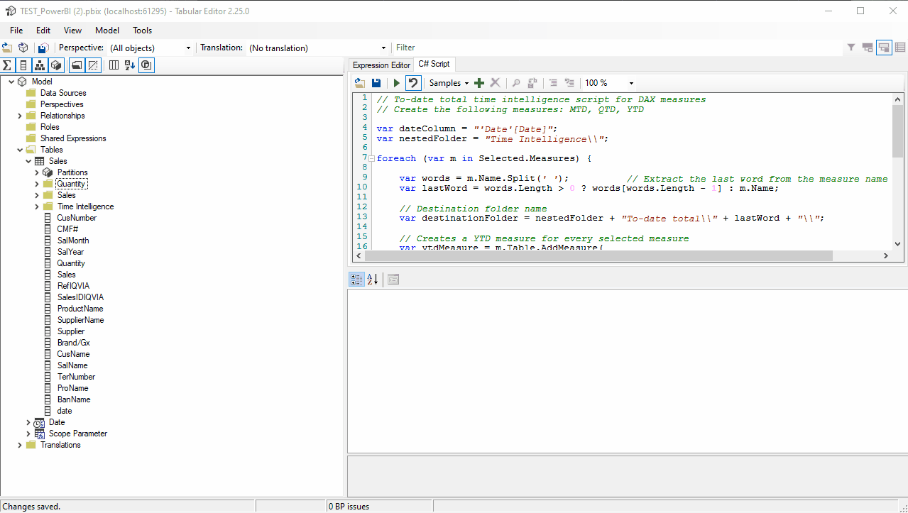

# C# Scripts for Automating DAX Measure Creation with Tabular Editor

Welcome to the repository! This project contains C# scripts designed to automate the creation of DAX measures in Power BI using Tabular Editor. These scripts will help you streamline the process of generating and managing DAX measures, making your Power BI models more efficient and error-free.

## 📚 Index

- [Features](#-features)
- [Prerequisites](#-prerequisites)
- [Running the Scripts](#-running-the-scripts)
- [Modifying the Scripts](#-modifying-the-scripts)
- [Tutorial](#-tutorial)

## 🔰 Features

- **Automated DAX Measure Creation**: Quickly generate common DAX measures such as YTD, MTD, and QTD.
- **Customizable Templates**: Tailor the scripts to fit your specific business needs.
- **Efficient Management**: Simplify the management of complex Power BI models.

## ⚡ Prerequisites

- Tabular Editor: [Download Link](https://cdn.tabulareditor.com/files/TabularEditor.2.25.0.Installer.msi)
- Basic knowledge of C# and DAX
- Power BI Desktop or Power BI Service

## 📂 Running the Scripts

1. Open your Power BI model in Tabular Editor (External Tools tab).
2. Navigate to the "Advanced Scripting" tab.
3. Copy and paste the desired script into the scripting window.
4. Click "Run Script" or press F5 to execute the script.
5. Verify the newly created measures in your model.
6. Visit the [Tutorial](#-tutorial) section for showcase videos.

## 📄 Modifying the Scripts

To customize the scripts for your specific needs:

1. Open the script file in a text editor or IDE.
2. Locate the sections marked with comments for customization.
3. Modify the variables, measure names, or DAX expressions as needed.
4. Save the changes and run the updated script in Tabular Editor.

## 🧠 Tutorial
Scripts should be run in the following order:
### 1. Run all the 'Dax Expressions' scripts in Power BI.
### 2. 'Measures/Aggregations' - creates your measures (SUM, AVG, MAX...)

### 3. 'Time Intelligence/*' - creates Time Intelligence measures based on your new measures.

### 4. 'Measures/MeasureComponents' - creates measure components that are used for visualizations.
